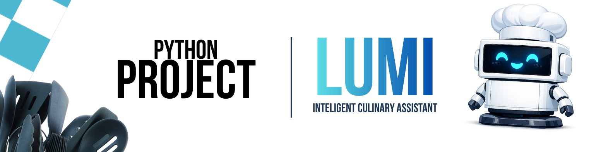

  

<h1 align="center">🤖 Project LUMI</h1>

  <b>Intelligent Culinary Assistant with AI, Voice Interaction and Physical Robot</b>

  
  
  
  
  
  

---

## 🎯 About The Project

**Project LUMI** is an intelligent culinary assistant designed to accompany the user throughout the entire cooking process.  
It interacts mainly through **voice**, maintains **context and memory**, and integrates a **physical robot** as its main interface.

Unlike traditional assistants, LUMI was architected with a **hybrid cognitive system**, where:

> **Artificial Intelligence is used only when it truly adds value.**  
> Most processing is handled through **deterministic logic, pattern recognition and scripted responses**, ensuring:
>
> - ⚡ Low latency  
> - 💸 Low operational cost  
> - 🧠 High reliability  
> - 🤖 Natural interaction  

---

## ✨ Key Features

- 🎙️ Voice interaction (Speech-to-Text & Text-to-Speech)
- 🧠 Contextual memory of cooking processes
- ⏱️ Smart timers and step tracking
- 🤖 Physical robot interface
- 🎭 Emotional display system
- 🧩 Hybrid AI + deterministic processing
- 🧠 Intelligent intent routing
- 📷 On-demand image analysis
- 🔄 Active cooking monitoring ("proof of life")

---

## 🧠 Cognitive Architecture

LUMI processes commands through a **three-layer cognitive pipeline**:

| Layer | Description | AI Usage |
|--------|-------------|-----------|
| 🟢 Script Engine | Timers, alarms, commands, responses, jokes, status | 0% |
| 🟡 Hybrid Engine | Suggestions, explanations, image evaluation | Partial |
| 🔴 AI Engine | Free conversation, creativity, complex reasoning | Full |

### Processing Flow

              User Input (Voice/Text)
                        ↓
              Speech-to-Text (if voice)
                        ↓
                  Intent Router
                        ↓
    ┌────────────┬──────────────┬─────────────┐
    │ Script     │     Hybrid   │      AI     │
    │ Engine     │     Engine   │    Engine   │
    └────────────┴──────────────┴─────────────┘
                        ↓
              Emotion Engine → Display
                        ↓
           Response Engine → Voice / Text

---

## 🎭 Emotional Display System

LUMI uses a simple **state machine** to display emotional feedback through its screen:

| State | Emotion |
|----------|----------|
| Idle | 😴 |
| Listening | 🎙️ |
| Processing | 🤔 |
| Speaking | 🙂 |
| Happy | 😄 |
| Joke | 😆 |
| Error | 😵 |

---

## ⏱️ Active Cooking Monitoring

LUMI keeps track of user interaction and provides **automatic check-ins**:

| Time Without Interaction | Action |
|---------------------------|----------|
| 5 minutes | "Everything ok there?" |
| 10 minutes | "How's the recipe going?" |
| Context aware | Smart follow-ups |

---

## 🛠️ Technology Stack

### Backend

| Technology | Purpose |
|--------------|-----------|
| Python 3.11+ | Core language |
| FastAPI | REST API framework |
| PostgreSQL / SQLite | Persistence |
| Redis | Cache & memory |
| OpenAI API | AI reasoning |
| Docker (future) | Deployment |

---

### Physical Robot

| Component | Purpose |
|--------------|-----------|
| Raspberry Pi | Core controller |
| Microphone | Voice capture |
| Speakers | Voice output |
| OLED / LCD | Emotional display |
| 3D Printed Case | Physical structure |

---

## 🏗️ System Architecture

 🤖 Physical Robot
      ↓
    Backend Core
 (Python + FastAPI)
      ↓
 AI + Memory + Logic
      ↓
Database & Cache

---

## 🗺️ Project Roadmap

| Phase | Description |
|---------|--------------|
| 🧱 Phase 0 | Concept, identity, architecture & documentation |
| 🚀 Phase 1 | Backend core + AI integration (MVP) |
| 🧠 Phase 2 | Persistent memory & context engine |
| 🗣️ Phase 3 | Voice interaction (STT + TTS) |
| 🤖 Phase 4 | Physical robot prototype (LUMI Lite) |
| 🌟 Phase 5 | Deluxe version — full product experience |

---

## 🧪 Current Status

| Module | Status |
|-----------|----------|
| Concept & Design | ✅ Completed |
| Architecture | ✅ Completed |
| Backend Base | 🟡 In Progress |
| AI Integration | ⏳ Planned |
| Voice Interface | ⏳ Planned |
| Physical Robot | ⏳ Planned |

---

## 🖼️ Media — Photos & Videos

> This section will contain **real photos, videos and demonstrations** of LUMI development and physical assembly.

    📁 Github-Assets/
    ├── banner.png
    ├── robot_design.png
    ├── prototype_01.jpg
    ├── assembly_video.mp4

---

## 🎯 Project Goal

This project was created as a **flagship portfolio project**, aiming to demonstrate:

| Skill | Description |
|----------|--------------|
| 🧠 Software Engineering | Clean architecture, modular design |
| ⚙️ Backend Development | APIs, persistence, services |
| 🤖 Applied AI | Real-world usage, cost optimization |
| 🎙️ Voice Systems | STT + TTS integration |
| 🔧 Robotics | Hardware + software integration |
| 🎨 Product Design | UX, emotion & experience |

---

## 👨‍💻 Author

Developed by **Diogo Teodoro**  
Information Systems Student  
Backend, AI & Robotics Enthusiast  

---

  🚀 Built with passion, curiosity and lots of coffee.

